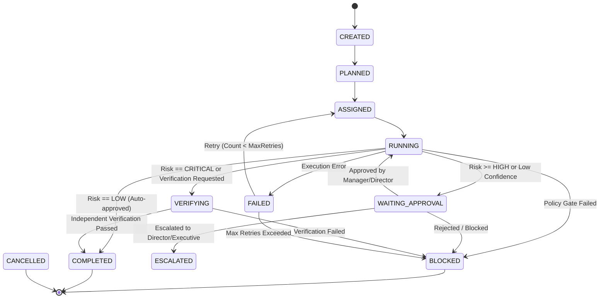
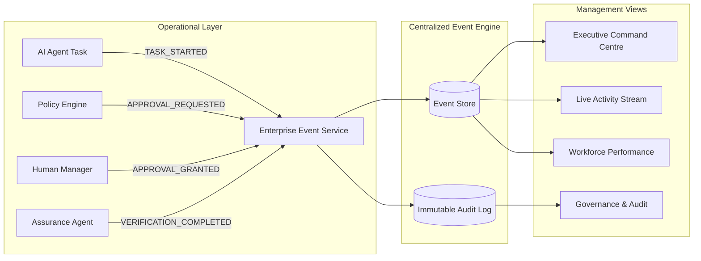
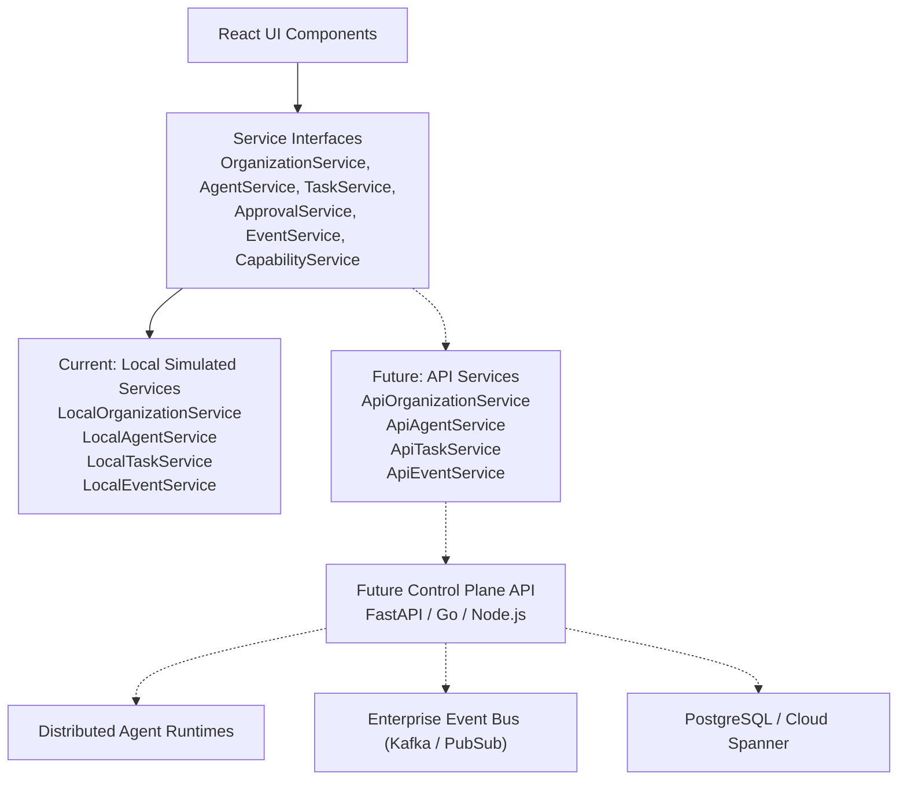

# AI Corporate Hierarchy & Enterprise Control Tower

## Executive Summary

The **AI Enterprise Control Tower** extends the Maritime Operations AI Control Tower platform with a corporate-grade operating model designed to govern, supervise, and interact with a multi-departmental hierarchy of autonomous AI agents.

### Core Architectural Principle

> *"Management has visibility across the organization and authority to intervene, while operational work remains delegated through the organizational hierarchy."*

Executive leadership and department heads are provided situational awareness and targeted escalation triggers without being overwhelmed by low-level micro-tasks. Operational execution remains delegated down through functional managers to specialized worker agents, bounded by deterministic risk rules, capability availability states, and immutable audit logs.

---

## 1. Corporate Hierarchy & Workforce Architecture

The enterprise model separates human management roles, staff advisory functions, and autonomous worker agents into explicit entity types:

- **`HUMAN`**: Operational leaders who hold ultimate managerial, supervisory, and legal authority (CEO, Directors, Managers).
- **`AI_ADVISOR`**: Advisory staff entities providing synthesized intelligence directly to executive management without hierarchical command authority over directors or departments.
- **`AI_AGENT`**: Autonomous operational workers executing domain-specific tasks, tool invocations, and anomaly evaluations.

```mermaid
graph TD
    CEO["CEO / Executive Management<br/>(HUMAN)"]
    ADVISOR["Executive AI Advisor<br/>(AI_ADVISOR)"]
    
    DIR_OPS["Fleet Operations Director<br/>(HUMAN)"]
    DIR_TECH["Technical & Maintenance Director<br/>(HUMAN)"]
    DIR_SAFE["Safety & Compliance Director<br/>(HUMAN)"]
    DIR_DIGI["Digital & Technology Director<br/>(HUMAN)"]
    DIR_ASSUR["Assurance Director<br/>(HUMAN)"]

    CEO --- ADVISOR
    CEO --> DIR_OPS
    CEO --> DIR_TECH
    CEO --> DIR_SAFE
    CEO --> DIR_DIGI
    CEO --> DIR_ASSUR

    %% Operations
    MGR_OPS["Fleet Operations Manager<br/>(HUMAN)"]
    MGR_VOY["Voyage Performance Manager<br/>(HUMAN)"]
    DIR_OPS --> MGR_OPS
    DIR_OPS --> MGR_VOY
    
    AGT_FLT["Fleet Monitoring Agent<br/>(AI_AGENT)"]
    AGT_VES["Vessel Status Agent<br/>(AI_AGENT)"]
    AGT_EXC["Operations Exception Agent<br/>(AI_AGENT)"]
    MGR_OPS --> AGT_FLT
    MGR_OPS --> AGT_VES
    MGR_OPS --> AGT_EXC

    AGT_OPT["Voyage Optimisation Agent<br/>(AI_AGENT)"]
    AGT_FUEL["Fuel Performance Agent<br/>(AI_AGENT)"]
    AGT_WEA["Weather Routing Agent<br/>(AI_AGENT)"]
    MGR_VOY --> AGT_OPT
    MGR_VOY --> AGT_FUEL
    MGR_VOY --> AGT_WEA

    %% Technical
    MGR_TECH["Technical Manager<br/>(HUMAN)"]
    DIR_TECH --> MGR_TECH
    AGT_PRED["Predictive Maintenance Agent<br/>(AI_AGENT)"]
    AGT_EQP["Equipment Health Agent<br/>(AI_AGENT)"]
    AGT_WO["Work Order Recommendation Agent<br/>(AI_AGENT)"]
    MGR_TECH --> AGT_PRED
    MGR_TECH --> AGT_EQP
    MGR_TECH --> AGT_WO

    %% Safety
    MGR_SAFE["Safety Manager<br/>(HUMAN)"]
    DIR_SAFE --> MGR_SAFE
    AGT_SAFE["Safety Monitoring Agent<br/>(AI_AGENT)"]
    AGT_INC["Incident Analysis Agent<br/>(AI_AGENT)"]
    AGT_COMP["Compliance Monitoring Agent<br/>(AI_AGENT)"]
    MGR_SAFE --> AGT_SAFE
    MGR_SAFE --> AGT_INC
    MGR_SAFE --> AGT_COMP

    %% Technology
    MGR_TECH_OPS["Technology Manager<br/>(HUMAN)"]
    DIR_DIGI --> MGR_TECH_OPS
    AGT_INT["Integration Monitoring Agent<br/>(AI_AGENT)"]
    AGT_DQ["Data Quality Agent<br/>(AI_AGENT)"]
    AGT_PLAT["Platform Operations Agent<br/>(AI_AGENT)"]
    MGR_TECH_OPS --> AGT_INT
    MGR_TECH_OPS --> AGT_DQ
    MGR_TECH_OPS --> AGT_PLAT

    %% Assurance
    MGR_QA["QA Manager<br/>(HUMAN)"]
    MGR_SEC["Security Manager<br/>(HUMAN)"]
    AGT_IND["Independent Verification Agent<br/>(AI_AGENT)"]
    DIR_ASSUR --> MGR_QA
    DIR_ASSUR --> MGR_SEC
    DIR_ASSUR --> AGT_IND
    
    AGT_QA["QA Agent<br/>(AI_AGENT)"]
    AGT_SEC["Security Agent<br/>(AI_AGENT)"]
    MGR_QA --> AGT_QA
    MGR_SEC --> AGT_SEC
```



---

## 2. Authority & Permission Matrix

Reporting hierarchy does **not** automatically grant arbitrary operational permissions. Authority levels are explicitly partitioned into standard corporate tiers:

| Authority Level | Target Roles | Key Permissions |
| :--- | :--- | :--- |
| **EXECUTIVE** | CEO, Executive AI Advisor (advisory) | Full enterprise visibility, executive overrides, critical risk sign-off, global policy enforcement. |
| **DIRECTOR** | Department Directors | Department oversight, high/critical approval, resource allocation, manager delegation. |
| **MANAGER** | Department Managers | Operational task assignment, medium/high risk approvals, re-analysis requests, agent pause/resume. |
| **LEAD** | Coordinators & Team Leads | Workflow supervision, reassignments, low/medium risk reviews. |
| **AGENT** | Worker AI Agents | Autonomous execution within bounded toolsets, recommendation generation, low-risk auto-completion. |
| **OBSERVER** | Auditors, Regulators | Read-only enterprise audit log, policy verification, metrics inspection. |

---

## 3. Deterministic Risk & Approval Governance

The platform strictly prohibits unconstrained AI self-approval. Task risk levels dictate deterministic workflow transitions:



### Deterministic Policy Register

1. **`POL-HIGH-RISK-APPROVAL`**: Any task rated `HIGH` or `CRITICAL` risk is mandatorily paused in `WAITING_APPROVAL`. Automatic execution is prohibited.
2. **`POL-CRITICAL-EXEC-BLOCK`**: Tasks rated `CRITICAL` risk require human Director or Executive sign-off followed by mandatory verification by the `Independent Verification Agent`.
3. **`POL-LOW-CONFIDENCE-ESCALATE`**: Recommendations generated with confidence score `< 80%` are automatically escalated to the responsible department manager.
4. **`POL-MAX-RETRY`**: Maximum retry threshold is capped at 3 attempts. Upon reaching threshold, the task transitions to `BLOCKED` and requires manual review.
5. **`POL-INDEPENDENT-VERIFICATION`**: High-impact operational modifications (e.g. voyage deviation, work orders exceeding $50k) require an independent assurance audit before closure.
6. **`POL-EXTERNAL-ACTION-HUMAN-APPROVAL`**: Destructive actions, write-backs, or third-party dispatch strictly require affirmative human confirmation.

---

## 4. Capability Registry & Graceful Degradation

AI agents do not depend on monolithic vendor APIs; they declare **Business Capabilities**:

```typescript
export interface AgentCapabilityProfile {
  requiredCapabilities: CapabilityId[];
  optionalCapabilities: CapabilityId[];
}
```

Capabilities operate in one of four states:
- `AVAILABLE`: Real-time production connectivity active.
- `SIMULATED`: Operational logic simulated via client-side deterministic datasets.
- `DEGRADED`: Partial or delayed data availability.
- `UNAVAILABLE`: Capability offline or disabled.

### Agent Operational Modes

- **`FULL`**: All required and optional capabilities are available or simulated.
- **`LIMITED`**: All required capabilities available; one or more optional capabilities unavailable (e.g. Weather Routing Agent running without ocean wave spectrum telemetry).
- **`DEGRADED`**: One or more required capabilities degraded; output marked with lower confidence and mandatory review flags.
- **`UNAVAILABLE`**: One or more required capabilities unavailable; agent transitions to `BLOCKED` or `PAUSED` and cannot execute tasks.

---

## 5. Enterprise Event Architecture & Audit Trail

All meaningful agent, task, and supervisory interactions publish structured events to a centralized **Enterprise Event Store**:



### Event Payload Standard

```json
{
  "eventId": "EVT-000842",
  "eventType": "TASK_ESCALATED",
  "actorId": "AGT-VOY-003",
  "actorName": "Voyage Optimisation Agent",
  "departmentId": "DEPT-FLEET-OPS",
  "taskId": "TASK-0842",
  "severity": "HIGH",
  "escalatedTo": "ROLE-OPS-DIRECTOR",
  "timestamp": "2026-09-18T10:42:00Z",
  "summary": "Fuel optimisation recommendation exceeded configured risk threshold."
}
```

---

## 6. UI Navigation & Module Structure

The AI Enterprise Control Tower introduces 8 specialized corporate views accessible under the **AI ENTERPRISE** navigation section:

1. **Executive Command Centre** (`#/command-centre`):
   - High-level KPIs: Total workforce, active agents, degraded agents, active tasks, pending approvals, critical risks.
   - Categorized "Needs Attention" exceptions vs. "No Action Required" green baselines.
   - Departmental health breakdown cards with active agent/task counters and direct drill-downs.
2. **Organization Chart** (`#/organization`):
   - Interactive, data-driven corporate tree rendering CEO, advisory staff, Directors, Managers, and Agents.
   - Visual badges distinguishing `HUMAN` vs. `AI_AGENT` vs. `AI_ADVISOR`.
   - Entity drill-down modal displaying status, authority level, active assignments, and reporting lines.
3. **AI Workforce Directory** (`#/workforce`):
   - Filterable directory with search by name, department, entity type, status, and operational mode.
   - **Agent Profile Drawer**: Displays identity, capabilities, available tools, metrics, structured rationale summaries, and supervisory management controls (Pause, Resume, Reassign, Verify, Disable Tool).
4. **Task Operations** (`#/tasks`):
   - Enterprise task register filtering by status, priority, risk, department, and assigned agent.
   - **Task Detail Drawer**: Complete audit timeline, evidence references, approval gates, verification state, and supervisor action buttons.
5. **Decision & Approval Inbox** (`#/approvals`):
   - Triage inbox categorized into *Awaiting My Approval*, *Escalations*, *Verification Required*, and *Recently Resolved*.
   - High-risk approval confirmation modal enforcing deterministic risk sign-offs.
6. **Live Activity Stream** (`#/activity`):
   - Centralized, multi-actor chronological event timeline with filters for department, actor, and event type.
7. **Performance Analytics** (`#/performance`):
   - Aggregate metrics: Total tasks, success rate, escalation rate, average duration, quality score, SLA compliance, and verification pass rate across enterprise, department, and agent levels.
8. **Governance & Audit** (`#/governance`):
   - Interactive Policy Register, Capability Registry with live status simulation toggles, and an immutable, tamper-evident Audit Log.

---

## 7. Simulated vs. Real Production Boundary

Because this repository is a static client-side prototype hosted on GitHub Pages:

| Dimension | Prototype Implementation | Future Production Implementation |
| :--- | :--- | :--- |
| **Authentication & SSO** | Simulated role switching & mock human actors | OpenID Connect / SAML 2.0 enterprise identity provider |
| **Agent Execution** | Deterministic browser simulation via seed data & local events | Scalable containerized agent runtimes (e.g. LangChain, Semantic Kernel, Celery) |
| **Data Persistence** | Reactive state + browser `localStorage` cache | Cloud PostgreSQL / Spanner with Redis caching |
| **Event Bus** | Centralized in-memory `EnterpriseEventService` | Apache Kafka, AWS EventBridge, or Google Cloud Pub/Sub |
| **Control Actions** | Client-side state mutation labeled with simulated warning banner | Secure gRPC / REST API control plane with RBAC authorization |
| **External Systems** | Static vessel & voyage JSON telemetry | Live AIS feeds, NMEA 0183/2000 vessel telemetry, weather APIs |

Every interactive supervisory control explicitly presents the banner:
> **"Simulated prototype control — no external system action executed."**

---

## 8. Migration Path to Future Control Plane

The frontend architecture strictly isolates UI components from data implementations through service interfaces:



Replacing `LocalAgentService` with `ApiAgentService` requires zero changes to the React views, component tree, or user interface state management.
